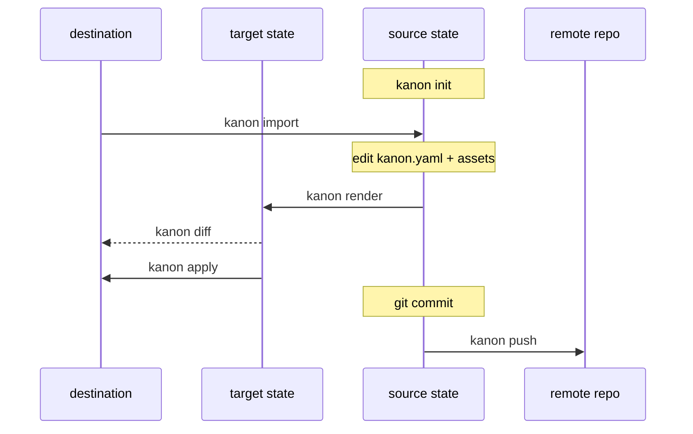
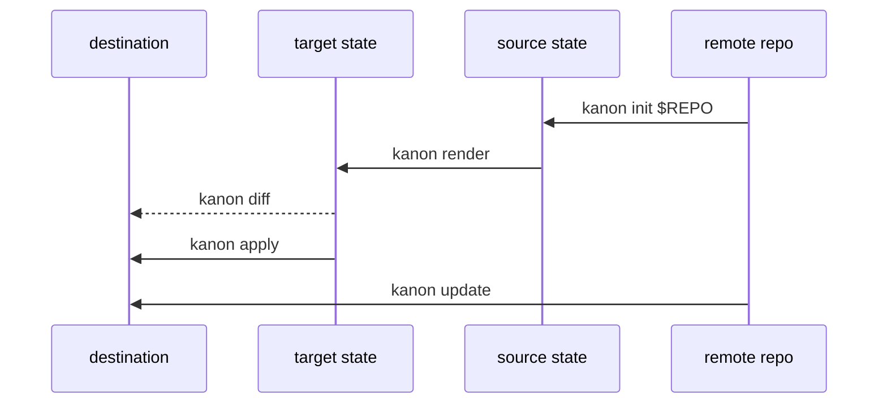

# kanon

Manage multiple coding-agent settings across multiple diverse machines.

Kanon compiles **one** neutral settings spec into the native files each coding
agent expects, and keeps those files in sync across machines. The model mirrors
[chezmoi](https://www.chezmoi.io/), with one extra step: a compiler in the
middle that fans a single source out to many agents.

## Concepts

Kanon moves your settings between three states, plus a git remote for sharing:

- **Source state** — `kanon.yaml` plus `instructions/`, `skills/`, and `hooks/`
  in the Kanon home. The single source of truth, tracked in git.
- **Target state** — the agent-native files **computed** from the source by the
  per-agent adapters (`codex`, `claude`). Never stored; recomputed on demand.
- **Destination state** — the real files on this machine.

### Set up kanon on your current machine



### Set up another machine and keep it in sync



Every command is an arrow between two states:

| Command | Moves | Description |
|---|---|---|
| `init` | remote → source | Create a new source repository, or clone `[repo]` from a remote |
| `validate` | source | Check `kanon.yaml` and referenced assets |
| `render` | source → target | Compile and print the agent-native files |
| `diff` | target ↔ destination | Preview the changes apply would make |
| `apply` | target → destination | Write the changes to disk |
| `status` | — | Source git status and destination drift |
| `import` (alias `add`) | destination → source | Capture existing agent files into the spec |
| `update` | remote → destination | Pull, then render and apply in one step |
| `pull` / `push` | source ↔ remote | Sync the source with a git remote |

## Quick start

```sh
kanon init     # scaffold the source repo
kanon render   # inspect the target state
kanon diff     # preview changes against disk
kanon apply    # write the changes
```

The source repository defaults to `~/.config/kanon`; set `KANON_HOME` or pass
`--home` to point elsewhere. On another machine, `kanon update` pulls and applies
in one step; use `kanon pull` / `kanon push` for explicit git sync.

## Managed settings

From the source state, Kanon renders:

- instructions into `AGENTS.md` and `CLAUDE.md`
- skills into Codex and Claude skill directories
- MCP server definitions
- hooks

The default flow is preview first (`render` / `diff`), then `apply`. Existing
unmanaged files block writes unless `--adopt` is passed, and overwritten files
are backed up under `.kanon/backups`.

Skills may be stored locally under `skills/<name>` or materialized from a
pinned git source:

```yaml
skills:
  - name: code-reviewer
    source:
      type: git
      url: https://github.com/acme/agent-skills.git
      ref: 8f3c4e2d9a1b0c7d6e5f4a3b2c1d0e9f8a7b6c5d
      subdir: code-reviewer
```

Remote skills are fetched automatically the first time `render`, `diff`,
`apply`, `status`, or `update` needs them. Kanon caches materialized sources
under `.kanon/cache/sources/`, which is gitignored by the starter `.gitignore`;
if the cache already exists, Kanon reuses it and does not refresh it. Pin `ref`
to a commit SHA for reproducible behavior across machines.

The source is the single source of truth: when you remove an instruction,
skill, or hook from the source, `apply` deletes the file it generated so the
destination stays a projection of the source (deletions are backed up too, and
scoped to the selected `--agent`/`--project`). Co-owned config files that the
agent also writes — `settings.json`, `.claude.json`, and Codex `config.toml` —
are written but never deleted.

## Importing existing settings

```sh
kanon import --agent all
kanon import --agent all --write
kanon import --agent all --write --force
```

`import` runs the pipeline in reverse: it reads existing Codex and Claude files
(the destination state) and normalizes them back into the neutral source state.
Imported config is neutral by default: instructions, skills, MCP servers, and
hooks are lifted into top-level sections with optional `targets` when a setting
only applies to some agents. Native fields that do not map to the neutral schema
are skipped with warnings, including agent permission settings, which kanon does
not manage.

For now, import supports `--secret-policy keep` only. Secret-looking values are
preserved and reported with warnings so you can move them to environment
references or another secret manager manually. Future policies for env refs,
omission, password managers, and encrypted secrets are tracked in code TODOs.

If both `AGENTS.md` and `CLAUDE.md` exist and differ, import stops by default.
Re-run with `--instruction-policy codex`, `claude`, `merge`, or `skip` to choose
how to create neutral instructions. `--write` refuses to replace an existing
`kanon.yaml`; use `--force` when intentionally re-importing.
