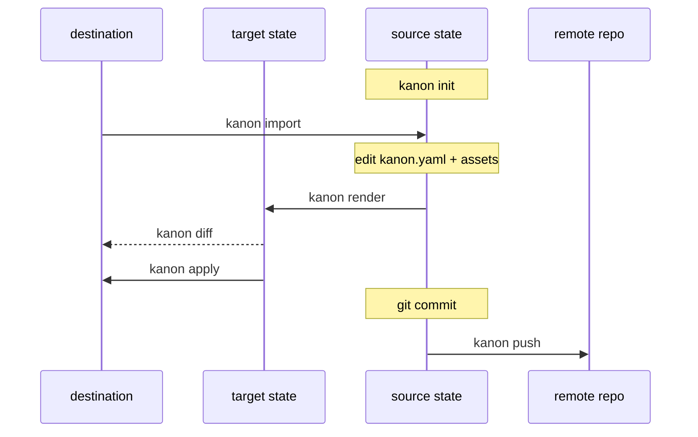
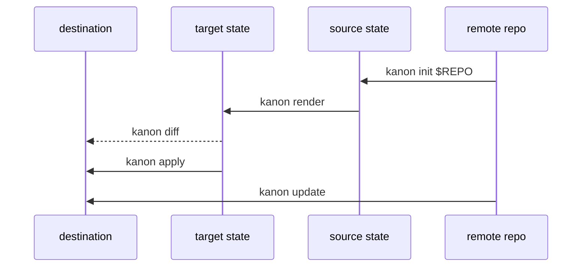

# kanon

Manage multiple coding-agent settings across multiple diverse machines.

Kanon compiles **one** neutral settings spec into the native files each coding
agent expects, and keeps those files in sync across machines. The model mirrors
[chezmoi](https://www.chezmoi.io/), with one extra step: a compiler in the
middle that fans a single source out to many agents.

## Concepts

Kanon moves your settings between three states, plus a git remote for sharing:

- **Source state** — `kanon.yaml` plus `instructions/`, `skills/`, and `hooks/`
  in the Kanon home. The single source of truth, tracked in git.
- **Target state** — the agent-native files **computed** from the source by the
  per-agent adapters (`codex`, `claude`). Never stored; recomputed on demand.
- **Destination state** — the real files on this machine.

### Set up kanon on your current machine



### Set up another machine and keep it in sync



Every command is an arrow between two states:

| Command | Moves | Description |
|---|---|---|
| `init` | remote → source | Create a new source repository, or clone `[repo]` from a remote |
| `validate` | source | Check `kanon.yaml` and referenced assets |
| `render` | source → target | Compile and print the agent-native files |
| `diff` | target ↔ destination | Preview the changes apply would make |
| `apply` | target → destination | Write the changes to disk |
| `status` | — | Source git status and destination drift |
| `lock` | source | Create or repair `kanon.lock` git skill provider pins |
| `lock check` | source | Verify git skill provider pins against `kanon.lock` |
| `lock update` | source | Intentionally re-resolve git skill provider pins in `kanon.lock` |
| `import` (alias `add`) | destination → source | Capture existing agent files into the spec |
| `update` | remote → destination | Pull, then render and apply in one step |
| `ui` | target ↔ destination | Review, select, and apply changes in an interactive TUI |
| `pull` / `push` | source ↔ remote | Sync the source with a git remote |

## Installation

Install with Go:

```sh
go install github.com/kelos-dev/kanon@latest
```

`go install` writes the `kanon` binary to `$(go env GOPATH)/bin`, or to
`GOBIN` when it is set. Make sure that directory is on your `PATH`.

From a local checkout, build the command into `./bin/kanon`:

```sh
make build
./bin/kanon --help
```

## Quick start

```sh
kanon init        # scaffold the source repo
kanon import --ui # review and import existing destination settings
kanon render      # inspect the target state
kanon diff        # preview changes against disk
kanon apply       # write the changes
kanon ui          # interactively review and apply selected changes
```

The source repository defaults to `~/.config/kanon`; set `KANON_HOME` or pass
`--home` to point elsewhere. On another machine, `kanon update` pulls and applies
in one step; use `kanon pull` / `kanon push` for explicit git sync.

If this machine already has Codex or Claude settings, start with
`kanon import --ui`. It lets you review discovered instructions, skills, MCP
servers, and hooks one item at a time before adding them to the Kanon source.

## Example repository

For a concrete Kanon source layout, see
[github.com/gjkim42/kanon-repo](https://github.com/gjkim42/kanon-repo). It shows
how `kanon.yaml`, instructions, skills, and other source assets can be organized
in a repository that is shared across machines.

## Rendered settings

From the source state, Kanon renders:

- instructions into `AGENTS.md` and `CLAUDE.md`
- skills into Codex and Claude skill directories
- MCP server definitions
- hooks

The default flow is preview first (`render` / `diff`), then `apply`. Rendered
files are compared directly with the destination and overwritten when they
differ. Files that are not rendered by the current source are outside the apply
plan: Kanon does not scan for them, list them, delete them, or keep destination
state for them. Both `apply` and `update` accept `--dry-run` (`-n`) to print the
changes they would make without touching the destination. For `update`, the
`git pull` still runs (so the preview reflects the updated source); only the
destination writes are skipped.

Local skills are stored under `skills/<name>` and rendered automatically:

```text
skills/code-reviewer/SKILL.md
```

Remote skill directories are configured as git providers in `skills`. Each
direct child directory under `git.subdir` must be a skill directory with its own
`SKILL.md`; Kanon renders each child using the provider namespace and child
directory name:

```yaml
skills:
  - git:
      url: https://github.com/acme/agent-skills.git
      ref: 8f3c4e2d9a1b0c7d6e5f4a3b2c1d0e9f8a7b6c5d
      subdir: skills
```

Kanon derives the provider namespace from the git URL by stripping `.git` from
the repository name. With that config, a remote
`skills/code-reviewer/SKILL.md` renders as `agent-skills:code-reviewer`, so it
does not collide with a local `skills/code-reviewer/SKILL.md`. Set `name`
when you want a different namespace or when two providers would derive the same
one.

Use `include` or `exclude` to render only part of a source:

```yaml
skills:
  - name: shared
    git:
      url: https://github.com/acme/agent-skills.git
      ref: main
      subdir: skills
    include:
      - code-reviewer
```

Git skill providers are fetched automatically the first time `render`, `diff`,
`apply`, `status`, or `update` needs them. Kanon caches materialized providers
under `.kanon/cache/sources/`, which is gitignored by the starter `.gitignore`;
if the cache already exists, Kanon reuses it and does not refresh it. Pin `ref`
to a commit SHA for reproducible behavior across machines.

For mutable refs such as branches or tags, run `kanon lock` to write a tracked
`kanon.lock` entry with the resolved commit and a stable content hash for each
enabled git skill provider. When a matching lock entry exists, render, diff,
apply, status, and update materialize that locked commit instead of the mutable
declared ref. Plain `kanon lock` preserves existing pins when their configured
coordinates still match, so it will not silently advance a branch.
Use `kanon lock check` in CI to fail when a git skill provider is missing from the
lockfile, its configured coordinates changed, its declared ref now resolves
somewhere else, or the cached content does not match the locked hash. Use
`kanon lock update <provider-name>` or `kanon lock update --all` to intentionally
refresh lock entries.

Co-owned config files that the agent also writes are merged instead of replaced.
For Codex `config.toml` and Claude `.claude.json` / project `.mcp.json`, Kanon
updates the MCP server entries named in the source and preserves other fields
and server entries. For Claude `settings.json`, Kanon updates the rendered
`hooks` section and preserves other settings. If an existing co-owned config
cannot be parsed, the merge stops with an error and the file is left untouched.

## Importing existing settings

```sh
kanon import --ui
kanon import --agent all --ui
kanon import --agent all --write
kanon import --agent all --write --force
```

`import` runs the pipeline in reverse: it reads existing Codex and Claude files
(the destination state) and normalizes them back into the neutral source state.
For interactive use, prefer `kanon import --ui`: it reviews discovered
instructions, skills, MCP servers, and hooks as selectable import units before
writing them into the source. The same import review is available from
`kanon ui`; press `m` to switch between apply and import modes, or start there
with `kanon ui --mode import`.

Use `--write` for scripted imports that should write the full normalized result
without interactive review.

Imported config is neutral by default: instructions, skills, MCP servers, and
hooks are lifted into top-level sections with optional `targets` when a setting
only applies to some agents. Native fields that do not map to the neutral schema
are skipped with warnings, including agent permission settings, which kanon does
not manage.

For now, import supports `--secret-policy keep` only. Secret-looking values are
preserved and reported with warnings so you can move them to environment
references or another secret manager manually. Future policies for env refs,
omission, password managers, and encrypted secrets are tracked in code TODOs.

If both `AGENTS.md` and `CLAUDE.md` exist and differ, import stops by default.
Re-run with `--instruction-policy codex`, `claude`, `merge`, or `skip` to choose
how to create neutral instructions. `--write` refuses to replace an existing
`kanon.yaml`; use `--force` when intentionally re-importing.
