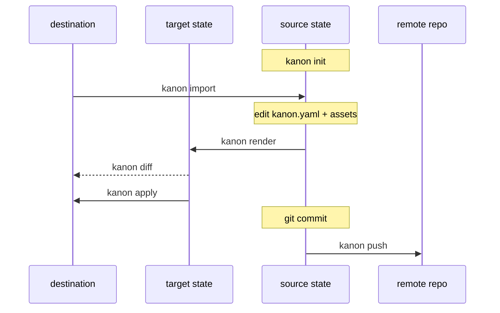
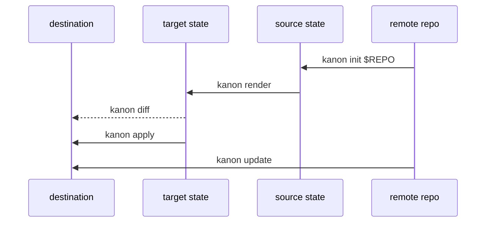

# kanon

Manage multiple coding-agent settings across multiple diverse machines.

Kanon compiles **one** neutral settings spec into the native files each coding
agent expects, and keeps those files in sync across machines. The model mirrors
[chezmoi](https://www.chezmoi.io/), with one extra step: a compiler in the
middle that fans a single source out to many agents.

## Concepts

Kanon moves your settings between three states, plus a git remote for sharing:

- **Source state** — `kanon.yaml` plus `instructions/`, `skills/`, and `hooks/`
  in the Kanon home. The single source of truth, tracked in git.
- **Target state** — the agent-native files **computed** from the source by the
  per-agent adapters (`codex`, `claude`). Never stored; recomputed on demand.
- **Destination state** — the real files on this machine.

### Set up kanon on your current machine



### Set up another machine and keep it in sync



Every command is an arrow between two states:

| Command | Moves | Description |
|---|---|---|
| `init` | remote → source | Create a new source repository, or clone `[repo]` from a remote |
| `validate` | source | Check `kanon.yaml` and referenced assets |
| `render` | source → target | Compile and print the agent-native files |
| `diff` | target ↔ destination | Preview the changes apply would make |
| `apply` | target → destination | Write the changes to disk |
| `status` | — | Source git status and destination drift |
| `import` (alias `add`) | destination → source | Capture existing agent files into the spec |
| `update` | remote → destination | Pull, then render and apply in one step |
| `pull` / `push` | source ↔ remote | Sync the source with a git remote |

## Quick start

```sh
kanon init     # scaffold the source repo
kanon render   # inspect the target state
kanon diff     # preview changes against disk
kanon apply    # write the changes
```

The source repository defaults to `~/.config/kanon`; set `KANON_HOME` or pass
`--home` to point elsewhere. On another machine, `kanon update` pulls and applies
in one step; use `kanon pull` / `kanon push` for explicit git sync.

## Managed settings

From the source state, Kanon renders:

- instructions into `AGENTS.md` and `CLAUDE.md`
- skills into Codex and Claude skill directories
- MCP server definitions
- hooks

The default flow is preview first (`render` / `diff`), then `apply`. Existing
unmanaged files block writes unless `--adopt` is passed, and overwritten files
are backed up under `.kanon/backups`.

The source is the single source of truth: when you remove an instruction,
skill, or hook from the source, `apply` deletes the file it generated so the
destination stays a projection of the source (deletions are backed up too, and
scoped to the selected `--agent`/`--project`). Co-owned config files that the
agent also writes — `settings.json`, `.claude.json`, and Codex `config.toml` —
are written but never deleted.

## `kanon.yaml` reference

`kanon.yaml` is the neutral source file Kanon renders into agent-native files.
Relative paths are resolved from the Kanon home, which defaults to
`~/.config/kanon`. Fields with `targets` render to all supported agents when the
field is omitted or empty; otherwise use `codex`, `claude`, or `all`.

```yaml
version: 1
instructions:
  files:
    - instructions/shared.md
skills:
  - name: example
    path: skills/example
    targets: [codex, claude]
    enabled: true
mcp:
  servers:
    docs:
      command: npx
      args: ["-y", "@example/docs-mcp"]
      env:
        API_KEY: "${DOCS_API_KEY}"
      targets: [codex]
      enabled: true
hooks:
  - name: stop-check
    event: Stop
    matcher: ""
    type: command
    command: hooks/stop-check.sh
    args: []
    timeout: 30
    async: false
    targets: [claude]
metadata:
  owner: team-dev
```

Top-level fields:

| Field | Type | Description |
|---|---|---|
| `version` | integer | Schema version. Omitted or `0` is treated as `1`; other versions fail validation. |
| `instructions.files` | list of strings | Instruction files to concatenate, separated by a blank line. Renders to `AGENTS.md` for Codex and `CLAUDE.md` for Claude. |
| `skills` | list | Skill directories to copy into each agent's skill directory. |
| `mcp.servers` | map | MCP server definitions keyed by server name. |
| `hooks` | list | Agent hook definitions. |
| `metadata` | map of strings | Optional metadata stored in the source file. Kanon currently preserves it but does not render it. |

Skill fields:

| Field | Type | Description |
|---|---|---|
| `name` | string | Required skill name. Also used as the default source directory name. |
| `path` | string | Optional source directory. Defaults to `skills/<name>`. The directory must contain `SKILL.md` for validation. |
| `targets` | list of strings | Optional agent filter: `codex`, `claude`, or `all`. |
| `enabled` | boolean | Optional. Defaults to `true`; `false` skips validation and rendering for the skill. |

MCP server fields:

| Field | Type | Description |
|---|---|---|
| `type` | string | Claude MCP server type. If omitted for Claude, Kanon uses `http` when `url` is set, otherwise `stdio`. Not rendered for Codex. |
| `command` | string | Command for stdio servers. Validation requires either `command` or `url`. |
| `args` | list of strings | Command arguments. |
| `env` | map of strings | Environment variables passed to the MCP server. |
| `env_vars` | list of strings | Codex-only environment variable allowlist rendered as `env_vars`. |
| `url` | string | URL for HTTP servers. Validation requires either `url` or `command`. |
| `headers` | map of strings | Literal HTTP headers. Rendered as Codex `http_headers` and Claude `headers`. |
| `env_headers` | map of strings | Header names mapped to environment variable names. Rendered as Codex `env_http_headers`; for Claude, values render as `${ENV_NAME}` in `headers`. |
| `bearer_token_env_var` | string | Codex-only bearer token environment variable field. |
| `startup_timeout_sec` | integer | Startup timeout in seconds. Rendered as Codex `startup_timeout_sec` and Claude `timeout`. |
| `tool_timeout_sec` | integer | Codex-only tool timeout in seconds. |
| `enabled_tools` | list of strings | Codex-only list of enabled MCP tools. |
| `disabled_tools` | list of strings | Codex-only list of disabled MCP tools. |
| `default_approval` | string | Codex-only default MCP tool approval. Rendered as `default_tool_approval`. |
| `tools` | map | Codex-only per-tool policy map. |
| `targets` | list of strings | Optional agent filter: `codex`, `claude`, or `all`. |
| `enabled` | boolean | Optional. Defaults to `true`; `false` skips validation and rendering for the server. |

Each entry under an MCP server's `tools` map supports `description`,
`approval`, and `approval_prompt`; these render only to Codex.

Hook fields:

| Field | Type | Description |
|---|---|---|
| `name` | string | Required hook name. If `event` is omitted, `name` is used as the hook event. |
| `event` | string | Agent hook event name. Hooks without `event` or `name` are skipped during rendering. |
| `matcher` | string | Optional matcher rendered with the hook item. |
| `type` | string | Hook handler type. If omitted and `command` is set, Kanon renders `command`. |
| `command` | string | Hook command. |
| `args` | list of strings | Hook command arguments. |
| `timeout` | integer | Timeout in seconds. Omitted from rendered files when `0`. |
| `async` | boolean | Renders `async: true` when set. |
| `targets` | list of strings | Optional agent filter: `codex`, `claude`, or `all`. |

String values can reference environment variables with `${NAME}` or
`${NAME:-default}`. Validation fails when `${NAME}` references an unset
environment variable without a default.

## Importing existing settings

```sh
kanon import --agent all
kanon import --agent all --write
kanon import --agent all --write --force
```

`import` runs the pipeline in reverse: it reads existing Codex and Claude files
(the destination state) and normalizes them back into the neutral source state.
Imported config is neutral by default: instructions, skills, MCP servers, and
hooks are lifted into top-level sections with optional `targets` when a setting
only applies to some agents. Native fields that do not map to the neutral schema
are skipped with warnings, including agent permission settings, which kanon does
not manage.

For now, import supports `--secret-policy keep` only. Secret-looking values are
preserved and reported with warnings so you can move them to environment
references or another secret manager manually. Future policies for env refs,
omission, password managers, and encrypted secrets are tracked in code TODOs.

If both `AGENTS.md` and `CLAUDE.md` exist and differ, import stops by default.
Re-run with `--instruction-policy codex`, `claude`, `merge`, or `skip` to choose
how to create neutral instructions. `--write` refuses to replace an existing
`kanon.yaml`; use `--force` when intentionally re-importing.
